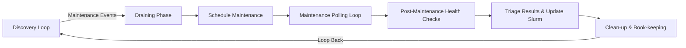
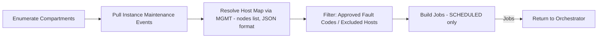
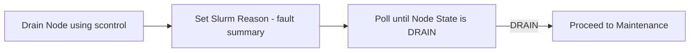
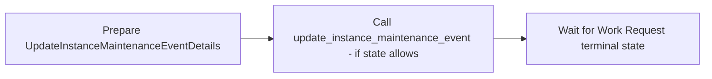
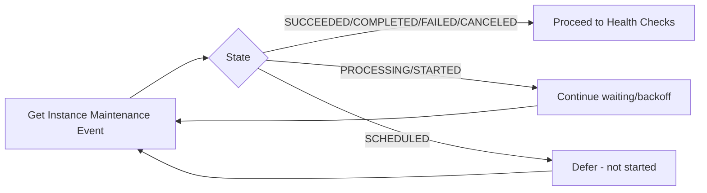
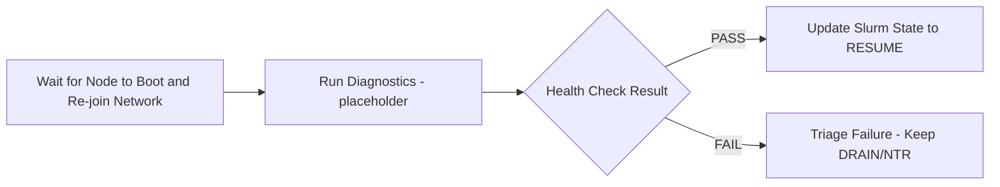
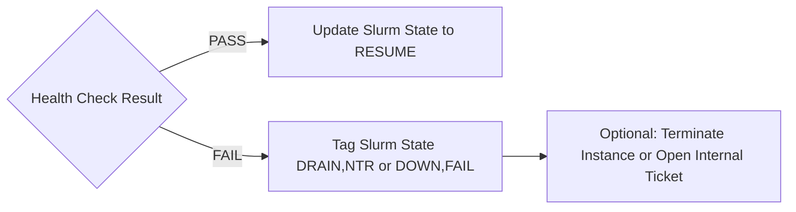
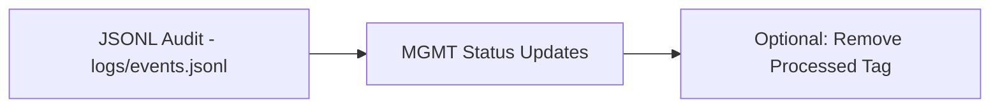

# Felix — OCI + Slurm Maintenance Orchestrator

## Overview

Felix orchestrates OCI instance maintenance events for HPC clusters integrated with Slurm. It discovers maintenance events across OCI compartments, maps events to Slurm nodes, safely drains nodes, schedules maintenance when allowed, monitors progress, performs post-maintenance health checks, and finalizes node state — with operator guardrails and clear visibility.

## Highlights

- Read-only discovery with rich table/JSON output
- Full workflow runner (discover → drain → schedule → health → finalize)
- Stage-only path (discover → drain → schedule; skips health/finalize)
- Periodic loop mode (continuous operations with interval control)
- Exact fault-code gating and excluded host list
- Dry-run mode for safe preview of actions
- JSONL audit log of key transitions
- Config via .env and JSON files

## High-Level Workflow

The maintenance process follows a structured workflow that can be broken down into several key phases. Here's a high-level overview:



## Detailed Workflow Phases

### 1. Discovery Loop

The discovery loop runs every ~15 minutes and performs the following steps:



1. Enumerate compartments using `list_compartments()`
2. Pull new maintenance events using `compute_client.list_instance_maintenance_events()`
3. Map events to hosts and GPUs using `mgmt_cli: manage.py nodes list json` and `scontrol show node <hostname>`

### 2. Draining Phase

The draining phase prepares the node for maintenance:



1. Drain the node using `scontrol update NODENAME=<host> STATE=DRAIN`
2. Poll until the node state changes to DRAIN using `sinfo -h -N -o "%N %t" | grep <host>`

### 3. Schedule Maintenance

Trigger the maintenance event using the OCI API:



1. Prepare `UpdateInstanceMaintenanceEventDetails` with `time_window_start` and `freeform_tags`
2. Call `compute_client.update_instance_maintenance_event()` to trigger maintenance
3. Track the work request using `workrequests_client.get_work_request(wr_id)`

### 4. Maintenance Polling Loop

Poll until the maintenance event is completed:



1. Continue calling `get_instance_maintenance_event(event.id)` until `lifecycle_state` is SUCCEEDED or COMPLETED
2. Implement back-off polling (e.g., 30s → 60s)

### 5. Post-Maintenance Health Checks

Verify the health of the node after maintenance:



1. Wait for the node to boot and re-join the network (optional ping/SSH check)
2. Run OCA plugin or custom GPU diagnostics (PCIe link check, GPU ECC, NVLink tests, etc.)
3. Parse results into PASS/FAIL

### 6. Triage Results & Update Slurm

Update Slurm state based on health check results:



1. If health check passes, update Slurm state to RESUME using `scontrol update NODENAME=<host> STATE=RESUME`
2. If health check fails, tag Slurm state as DRAIN,NTR or DOWN,FAIL and optionally terminate the instance or open an internal ticket

### 7. Clean-up & Book-keeping

Persist actions and remove processed tag:



1. Persist actions in CMDB or Quip sheet (node, event_id, outcome)
2. Remove the "processed" tag from the event list to avoid re-processing

## Implementation Details

The tool is implemented in Python and utilizes a multi-threaded approach to process multiple maintenance jobs concurrently. The `orchestrator.py` module manages the overall workflow, while specific phases are handled by dedicated modules in the `phases` package.

## Installation & Setup

### Prerequisites

- Python 3.9 or higher
- Access to OCI with appropriate credentials
- Slurm cluster access (for production use)

### Step 1: Clone the Repository

```bash
git clone <repository-url>
cd hpc-maintenance
```

### Step 2: Create and Activate Virtual Environment

```bash
# Create virtual environment
python3 -m venv .venv

# Activate virtual environment
# On Linux/macOS:
source .venv/bin/activate

# On Windows:
# .venv\Scripts\activate
```

### Step 3: Install Dependencies

```bash
# Install the package in editable mode with all dependencies
pip install -e .

# Alternatively, install dependencies from requirements.txt
pip install -r requirements.txt
```

### Step 4: Configure Environment

```bash
# Copy the template environment file
cp .env.local .env

# Edit .env and set required variables
# At minimum, configure:
#   - OCI_TENANCY_OCID=ocid1.tenancy.oc1..your_tenancy_ocid
#   - REGION=us-ashburn-1 (or your region)
```

### Step 5: Set Up Configuration Files

```bash
# Create config directory if it doesn't exist
mkdir -p config

# Create approved fault codes file
cat > config/approved_fault_codes.json << 'EOF'
[
  "HPCRDMA-0002-02",
  "COMPUTE-0001-01"
]
EOF

# Create excluded hosts file (empty array if none)
cat > config/excluded_hosts.json << 'EOF'
[]
EOF
```

### Step 6: Verify Installation

```bash
# Check felix is installed correctly
felix --version

# Run a dry-run discovery to test configuration
felix discover --all

# Test with dry-run mode
felix run --dry-run
```

### Notes

- The `felix` command will be available in your PATH after installation
- Keep your virtual environment activated when running felix commands
- The `.env` file is gitignored to prevent committing secrets
- Configuration files under `config/` can be version controlled (without sensitive data)

## Usage

To run the maintenance tool, use the `felix` command with any of the subcommands listed in the CLI Options section below. The tool logs its activities to the configured log directory (default: `logs/`).

### Quick Start Examples

```bash
# Discover maintenance events (read-only)
felix discover

# Run full workflow once in dry-run mode (safe preview)
felix run --dry-run

# Run full workflow once (executes actions)
felix run

# Start continuous maintenance loop
felix loop

# Generate a report of all maintenance events
felix report
```

## Configuration

Configuration is read from environment variables loaded at runtime by `felix.config`. A template `.env.local` is provided; copy it to `.env` and edit values. The `.env` file is gitignored to avoid committing secrets.

Setup:
- Copy the template: `cp .env.local .env`
- Edit `.env` and set at minimum:
  - `OCI_TENANCY_OCID=ocid1.tenancy.oc1..your_tenancy_ocid`
  - `REGION=us-ashburn-1` (or your region)
- Optional variables:
  - `LOG_LEVEL`, `LOG_FILE`
  - `DRAIN_POLL_SEC`, `MAINT_POLL_SEC`
  - `DAILY_SCHEDULE_CAP`, `LOOP_INTERVAL_SEC`
  - `PROCESSED_TAG`
  - `EVENTS_LOG_FILE`
  - `APPROVED_FAULT_CODES` (comma-separated fallback) or use `config/approved_fault_codes.json`
  - `APPROVED_FAULT_CODES_FILE` (defaults to `config/approved_fault_codes.json`)
  - `EXCLUDED_HOSTS_FILE` (defaults to `config/excluded_hosts.json`)

Behavior:
- `.env` is loaded automatically at import time; variables present in the OS environment take precedence.
- Approved and excluded host lists are read from JSON files under `config/` by default, with environment fallbacks.

## Dependencies

The project dependencies are listed in `requirements.txt`. Ensure you have the necessary dependencies installed before running the tool.

## Current State Additions

- Stage-only workflow:
  - Command: felix stage
  - Steps: Discover → Drain → Schedule (skips Health and Finalize)
  - Use when you only want to drain and schedule maintenance while we iterate on post-maintenance actions.
- Dry-run mode:
  - Available on run, loop, and stage via --dry-run or -n
  - Prints intended actions only; does not call scontrol or schedule the OCI maintenance.
- JSONL event audit:
  - File: logs/events.jsonl (configurable via EVENTS_LOG_FILE)
  - Records key transitions for drain and maintenance (see examples below).
- Guardrails:
  - DAILY_SCHEDULE_CAP limits how many nodes can be actioned per pass.
- Exact fault matching and exclusions:
  - Approved fault codes are matched exactly from config/approved_fault_codes.json.
  - Hosts in config/excluded_hosts.json are skipped before any action.

## CLI Options

### Main Workflow Commands

- **Full workflow once:**
  ```bash
  felix run [--dry-run | -n]
  ```
  Executes the complete maintenance workflow: discover → drain → schedule → health → finalize

- **Periodic loop:**
  ```bash
  felix loop [--dry-run | -n]
  ```
  Runs the full maintenance workflow continuously at intervals (default: every LOOP_INTERVAL_SEC)

- **Stage-only workflow:**
  ```bash
  felix stage [--dry-run | -n]
  ```
  Executes partial workflow: discover → drain → schedule (skips health and finalize phases)

- **Catch-up reconciliation:**
  ```bash
  felix catchup [--host HOSTNAME] [--dry-run | -n]
  ```
  One-shot reconciliation for already-triggered maintenance events (no drain/schedule):
  - SUCCEEDED/COMPLETED events: runs health → finalize and sets MGMT to "running"
  - IN_PROGRESS/PROCESSING events: sets MGMT to "NTR scheduled" + reconfigures compute
  - Optional: limit to specific hostname with `--host`

### Discovery and Reporting Commands

- **Discovery phase:**
  ```bash
  felix discover [--json [FILE]] [--all]
  ```
  Runs discovery phase only (read-only, no changes):
  - Shows SCHEDULED events by default in a Rich table
  - `--all`: Show all maintenance states (not just SCHEDULED)
  - `--json`: Output JSON to stdout (if no FILE) or write to FILE; skips table output

- **Report maintenance events:**
  ```bash
  felix report [--include-canceled] [-x STATE] [--json [FILE]]
  ```
  Shows all instance maintenance events in a table:
  - `--include-canceled`: Include CANCELED events in the table
  - `-x STATE` or `--exclude STATE`: Exclude events in the given state (can be repeated)
  - `--json`: Output JSON to stdout (if no FILE) or write to FILE; skips table output

### Per-Phase Helper Commands

- **Drain phase:**
  ```bash
  felix drain <hostname>
  ```
  Runs drain phase for a specific hostname

- **Maintenance phase:**
  ```bash
  felix maintenance <hostname>
  ```
  Runs maintenance phase for a specific hostname

- **Health phase:**
  ```bash
  felix health <hostname>
  ```
  Runs health check phase for a specific hostname

- **Finalize phase:**
  ```bash
  felix finalize <hostname>
  ```
  Runs finalize phase for a specific hostname

### Global Options

- `--version`: Display felix version
- `--dry-run` or `-n`: Preview mode - shows intended actions without invoking scontrol or OCI scheduling; used to validate approved and excluded lists safely

### Notes

- Per-phase helper commands (drain, maintenance, health, finalize) automatically discover the maintenance job for the specified hostname before executing
- Dry-run mode is available for: run, loop, stage, and catchup commands
- JSON output options allow integration with external tools and automation scripts

## Configuration Updates

- Approved faults (exact match):
  - config/approved_fault_codes.json (JSON array of fault IDs)
  - Fallback: APPROVED_FAULT_CODES env var (comma-separated) if file is missing/empty.
- Excluded hosts:
  - config/excluded_hosts.json (JSON array of hostnames to skip for any action)
- Event log path:
  - EVENTS_LOG_FILE env var (default: logs/events.jsonl)
- Other relevant env:
  - DAILY_SCHEDULE_CAP (default: 10)
  - LOOP_INTERVAL_SEC (default: 900)
  - MAX_WORKERS (default: 8)
  - LOG_LEVEL, LOG_FILE

Matching behavior:
- Discovery collects raw fault_ids; only exact matches against approved list are actioned.
- Excluded hosts are filtered out before any drain/schedule.

## JSONL Event Audit Examples

- Drain requested and completion:
  {"ts":"2025-09-06T01:02:03Z","phase":"drain","action":"requested","host":"GPU-332","reason":"HPCRDMA-0002-02"}
  {"ts":"2025-09-06T01:02:45Z","phase":"drain","action":"drained_empty","host":"GPU-332"}

- Maintenance scheduling lifecycle:
  {"ts":"2025-09-06T01:03:00Z","phase":"maintenance","action":"schedule_request","host":"GPU-332","event_id":"ocid1...","window_start":"2025-09-06T01:08:00Z"}
  {"ts":"2025-09-06T01:03:01Z","phase":"maintenance","action":"schedule_accepted","host":"GPU-332","event_id":"ocid1...","work_request":"ocid1.workrequest..."}
  {"ts":"2025-09-06T12:40:00Z","phase":"maintenance","action":"event_complete","host":"GPU-332","event_id":"ocid1..."}

- Health (placeholder implementation for now):
  {"ts":"2025-09-06T12:41:00Z","phase":"health","action":"pass","host":"GPU-332"}

## Post-Maintenance TODOs (Planned)

Before automatically resuming nodes, implement:
- SSH readiness checks with retry/backoff.
- Log inspection for error signatures (configurable per fault type).
- Active validation tests mapped by fault type, for example:
  - GPU: DCGM diagnostics, ECC checks, PCIe link width/speed validation.
  - Networking: single-node NCCL/NiCOL, fabric ping, link error counters.
  - Compute: HPL/ROCm micro-benchmark sanity.
- Outcome handling:
  - PASS: update Slurm reason and RESUME.
  - FAIL: keep drained with reason; raise ticket/alert.
- JSONL event coverage for each step; MGMT status updates aligned with state.

These items correspond to the “Post-Maintenance Health Checks” and “Triage Results & Update Slurm” phases and will replace the current placeholder health logic.
