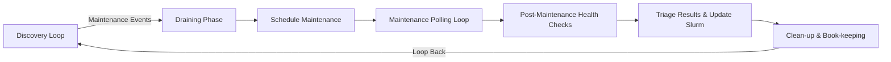
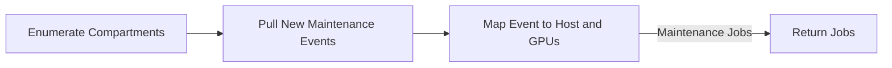
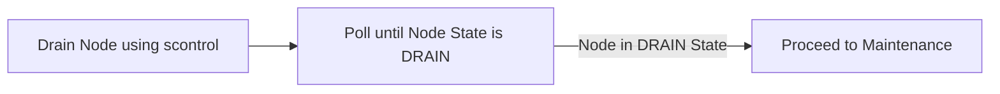
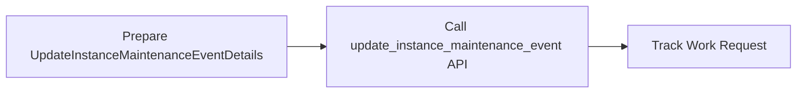
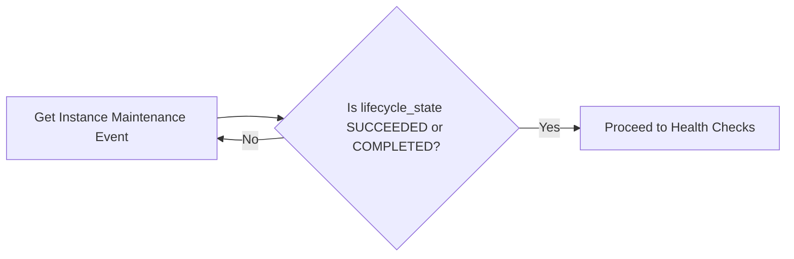
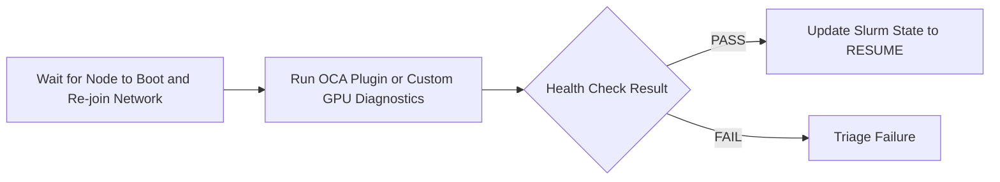
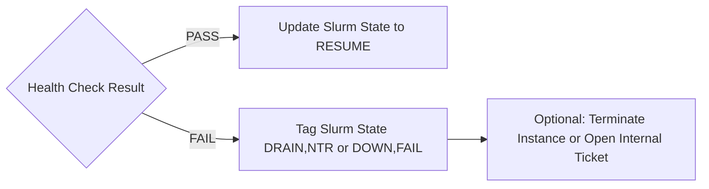
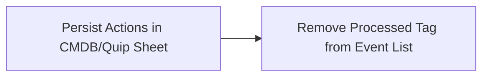

# HPC Maintenance Tool

## Overview

The HPC Maintenance Tool is designed to manage and orchestrate maintenance jobs for High-Performance Computing (HPC) systems. It interacts with Oracle Cloud Infrastructure (OCI) to discover maintenance events, process them through various phases, and ensure the health and availability of HPC nodes.

## High-Level Workflow

The maintenance process follows a structured workflow that can be broken down into several key phases. Here's a high-level overview:

## Detailed Workflow Phases

### 1. Discovery Loop

The discovery loop runs every ~15 minutes and performs the following steps:

1. Enumerate compartments using `list_compartments()`
2. Pull new maintenance events using `compute_client.list_instance_maintenance_events()`
3. Map events to hosts and GPUs using `mgmt_cli: manage.py nodes list json` and `scontrol show node <hostname>`

### 2. Draining Phase

The draining phase prepares the node for maintenance:

1. Drain the node using `scontrol update NODENAME=<host> STATE=DRAIN`
2. Poll until the node state changes to DRAIN using `sinfo -h -N -o "%N %t" | grep <host>`

### 3. Schedule Maintenance

Trigger the maintenance event using the OCI API:

1. Prepare `UpdateInstanceMaintenanceEventDetails` with `time_window_start` and `freeform_tags`
2. Call `compute_client.update_instance_maintenance_event()` to trigger maintenance
3. Track the work request using `workrequests_client.get_work_request(wr_id)`

### 4. Maintenance Polling Loop

Poll until the maintenance event is completed:

1. Continue calling `get_instance_maintenance_event(event.id)` until `lifecycle_state` is SUCCEEDED or COMPLETED
2. Implement back-off polling (e.g., 30s → 60s)

### 5. Post-Maintenance Health Checks

Verify the health of the node after maintenance:

1. Wait for the node to boot and re-join the network (optional ping/SSH check)
2. Run OCA plugin or custom GPU diagnostics (PCIe link check, GPU ECC, NVLink tests, etc.)
3. Parse results into PASS/FAIL

### 6. Triage Results & Update Slurm

Update Slurm state based on health check results:

1. If health check passes, update Slurm state to RESUME using `scontrol update NODENAME=<host> STATE=RESUME`
2. If health check fails, tag Slurm state as DRAIN,NTR or DOWN,FAIL and optionally terminate the instance or open an internal ticket

### 7. Clean-up & Book-keeping

Persist actions and remove processed tag:

1. Persist actions in CMDB or Quip sheet (node, event_id, outcome)
2. Remove the "processed" tag from the event list to avoid re-processing

## Implementation Details

The tool is implemented in Python and utilizes a multi-threaded approach to process multiple maintenance jobs concurrently. The `orchestrator.py` module manages the overall workflow, while specific phases are handled by dedicated modules in the `phases` package.

## Usage

To run the maintenance tool, execute the CLI command provided in `cli.py`. The tool logs its activities, and the log files can be found in the designated log directory.

## Configuration

The tool's configuration is managed through the `config.py` module. Key configurations include the maximum number of worker threads and specific tags used for tracking processed events.

## Dependencies

The project dependencies are listed in `requirements.txt`. Ensure you have the necessary dependencies installed before running the tool.
