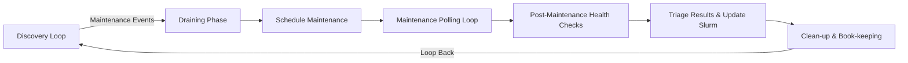
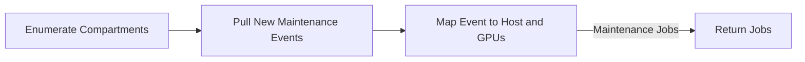
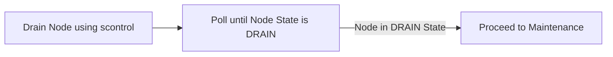
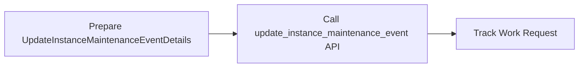
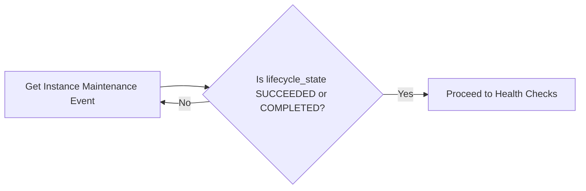
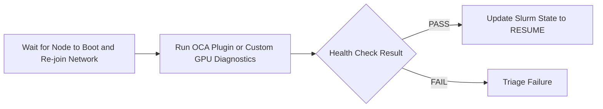
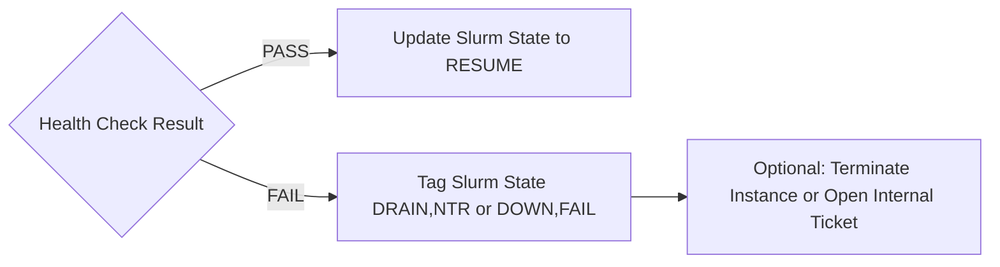
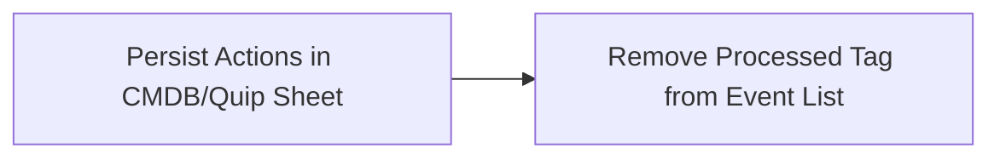

# HPC Maintenance Tool

## Overview

The HPC Maintenance Tool is designed to manage and orchestrate maintenance jobs for High-Performance Computing (HPC) systems. It interacts with Oracle Cloud Infrastructure (OCI) to discover maintenance events, process them through various phases, and ensure the health and availability of HPC nodes.

## High-Level Workflow

The maintenance process follows a structured workflow that can be broken down into several key phases. Here's a high-level overview:

## Detailed Workflow Phases

### 1. Discovery Loop

The discovery loop runs every ~15 minutes and performs the following steps:

1. Enumerate compartments using `list_compartments()`
2. Pull new maintenance events using `compute_client.list_instance_maintenance_events()`
3. Map events to hosts and GPUs using `mgmt_cli: manage.py nodes list json` and `scontrol show node <hostname>`

### 2. Draining Phase

The draining phase prepares the node for maintenance:

1. Drain the node using `scontrol update NODENAME=<host> STATE=DRAIN`
2. Poll until the node state changes to DRAIN using `sinfo -h -N -o "%N %t" | grep <host>`

### 3. Schedule Maintenance

Trigger the maintenance event using the OCI API:

1. Prepare `UpdateInstanceMaintenanceEventDetails` with `time_window_start` and `freeform_tags`
2. Call `compute_client.update_instance_maintenance_event()` to trigger maintenance
3. Track the work request using `workrequests_client.get_work_request(wr_id)`

### 4. Maintenance Polling Loop

Poll until the maintenance event is completed:

1. Continue calling `get_instance_maintenance_event(event.id)` until `lifecycle_state` is SUCCEEDED or COMPLETED
2. Implement back-off polling (e.g., 30s → 60s)

### 5. Post-Maintenance Health Checks

Verify the health of the node after maintenance:

1. Wait for the node to boot and re-join the network (optional ping/SSH check)
2. Run OCA plugin or custom GPU diagnostics (PCIe link check, GPU ECC, NVLink tests, etc.)
3. Parse results into PASS/FAIL

### 6. Triage Results & Update Slurm

Update Slurm state based on health check results:

1. If health check passes, update Slurm state to RESUME using `scontrol update NODENAME=<host> STATE=RESUME`
2. If health check fails, tag Slurm state as DRAIN,NTR or DOWN,FAIL and optionally terminate the instance or open an internal ticket

### 7. Clean-up & Book-keeping

Persist actions and remove processed tag:

1. Persist actions in CMDB or Quip sheet (node, event_id, outcome)
2. Remove the "processed" tag from the event list to avoid re-processing

## Implementation Details

The tool is implemented in Python and utilizes a multi-threaded approach to process multiple maintenance jobs concurrently. The `orchestrator.py` module manages the overall workflow, while specific phases are handled by dedicated modules in the `phases` package.

## Usage

To run the maintenance tool, execute the CLI command provided in `cli.py`. The tool logs its activities, and the log files can be found in the designated log directory.

## Configuration

Configuration is read from environment variables loaded at runtime by `felix.config`. A template `.env.local` is provided; copy it to `.env` and edit values. The `.env` file is gitignored to avoid committing secrets.

Setup:
- Copy the template: `cp .env.local .env`
- Edit `.env` and set at minimum:
  - `OCI_TENANCY_OCID=ocid1.tenancy.oc1..your_tenancy_ocid`
  - `REGION=us-ashburn-1` (or your region)
- Optional variables:
  - `LOG_LEVEL`, `LOG_FILE`
  - `DRAIN_POLL_SEC`, `MAINT_POLL_SEC`
  - `DAILY_SCHEDULE_CAP`, `LOOP_INTERVAL_SEC`
  - `PROCESSED_TAG`
  - `EVENTS_LOG_FILE`
  - `APPROVED_FAULT_CODES` (comma-separated fallback) or use `config/approved_fault_codes.json`
  - `APPROVED_FAULT_CODES_FILE` (defaults to `config/approved_fault_codes.json`)
  - `EXCLUDED_HOSTS_FILE` (defaults to `config/excluded_hosts.json`)

Behavior:
- `.env` is loaded automatically at import time; variables present in the OS environment take precedence.
- Approved and excluded host lists are read from JSON files under `config/` by default, with environment fallbacks.

## Dependencies

The project dependencies are listed in `requirements.txt`. Ensure you have the necessary dependencies installed before running the tool.

## Current State Additions

- Stage-only workflow:
  - Command: felix stage
  - Steps: Discover → Drain → Schedule (skips Health and Finalize)
  - Use when you only want to drain and schedule maintenance while we iterate on post-maintenance actions.
- Dry-run mode:
  - Available on run, loop, and stage via --dry-run or -n
  - Prints intended actions only; does not call scontrol or schedule the OCI maintenance.
- JSONL event audit:
  - File: logs/events.jsonl (configurable via EVENTS_LOG_FILE)
  - Records key transitions for drain and maintenance (see examples below).
- Guardrails:
  - DAILY_SCHEDULE_CAP limits how many nodes can be actioned per pass.
- Exact fault matching and exclusions:
  - Approved fault codes are matched exactly from config/approved_fault_codes.json.
  - Hosts in config/excluded_hosts.json are skipped before any action.

## New CLI Options

- Full workflow once:
  - felix run [--dry-run]
- Periodic loop (every LOOP_INTERVAL_SEC):
  - felix loop [--dry-run]
- Stage-only (discover → drain → schedule; no health/finalize):
  - felix stage [--dry-run]
- Visibility/reporting (no actions):
  - felix report
- Per-phase helpers (after discovery builds a job for the host):
  - felix drain <hostname>
  - felix maintenance <hostname>
  - felix health <hostname>
  - felix finalize <hostname>

Notes:
- --dry-run never invokes scontrol or OCI scheduling; used to validate approved and excluded lists safely.

## Configuration Updates

- Approved faults (exact match):
  - config/approved_fault_codes.json (JSON array of fault IDs)
  - Fallback: APPROVED_FAULT_CODES env var (comma-separated) if file is missing/empty.
- Excluded hosts:
  - config/excluded_hosts.json (JSON array of hostnames to skip for any action)
- Event log path:
  - EVENTS_LOG_FILE env var (default: logs/events.jsonl)
- Other relevant env:
  - DAILY_SCHEDULE_CAP (default: 10)
  - LOOP_INTERVAL_SEC (default: 900)
  - MAX_WORKERS (default: 8)
  - LOG_LEVEL, LOG_FILE

Matching behavior:
- Discovery collects raw fault_ids; only exact matches against approved list are actioned.
- Excluded hosts are filtered out before any drain/schedule.

## JSONL Event Audit Examples

- Drain requested and completion:
  {"ts":"2025-09-06T01:02:03Z","phase":"drain","action":"requested","host":"GPU-332","reason":"HPCRDMA-0002-02"}
  {"ts":"2025-09-06T01:02:45Z","phase":"drain","action":"drained_empty","host":"GPU-332"}

- Maintenance scheduling lifecycle:
  {"ts":"2025-09-06T01:03:00Z","phase":"maintenance","action":"schedule_request","host":"GPU-332","event_id":"ocid1...","window_start":"2025-09-06T01:08:00Z"}
  {"ts":"2025-09-06T01:03:01Z","phase":"maintenance","action":"schedule_accepted","host":"GPU-332","event_id":"ocid1...","work_request":"ocid1.workrequest..."}
  {"ts":"2025-09-06T12:40:00Z","phase":"maintenance","action":"event_complete","host":"GPU-332","event_id":"ocid1..."}

- Health (placeholder implementation for now):
  {"ts":"2025-09-06T12:41:00Z","phase":"health","action":"pass","host":"GPU-332"}

## Post-Maintenance TODOs (Planned)

Before automatically resuming nodes, implement:
- SSH readiness checks with retry/backoff.
- Log inspection for error signatures (configurable per fault type).
- Active validation tests mapped by fault type, for example:
  - GPU: DCGM diagnostics, ECC checks, PCIe link width/speed validation.
  - Networking: single-node NCCL/NiCOL, fabric ping, link error counters.
  - Compute: HPL/ROCm micro-benchmark sanity.
- Outcome handling:
  - PASS: update Slurm reason and RESUME.
  - FAIL: keep drained with reason; raise ticket/alert.
- JSONL event coverage for each step; MGMT status updates aligned with state.

These items correspond to the “Post-Maintenance Health Checks” and “Triage Results & Update Slurm” phases and will replace the current placeholder health logic.
